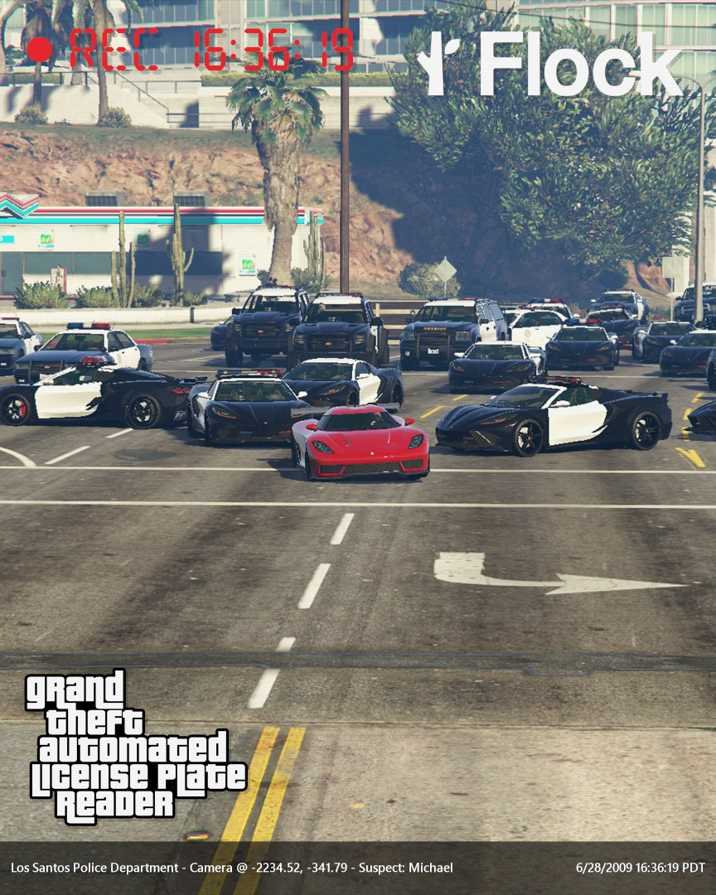
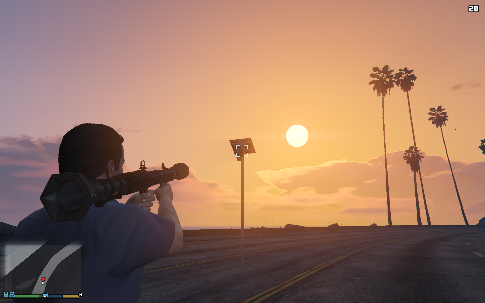
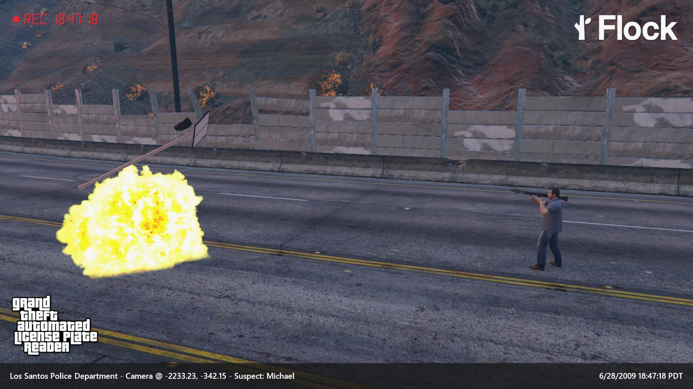
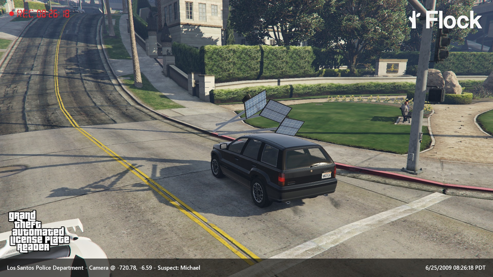
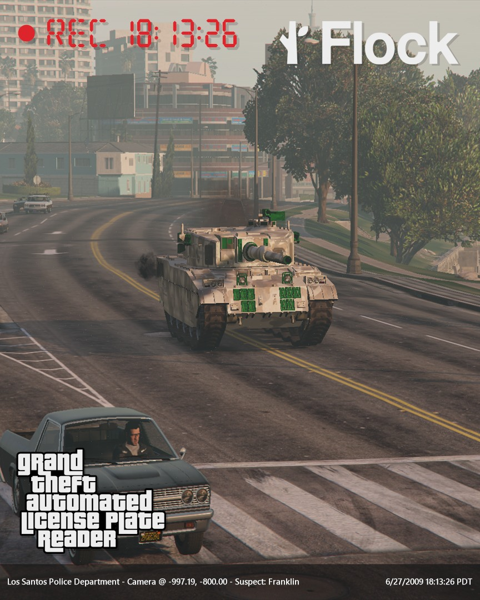
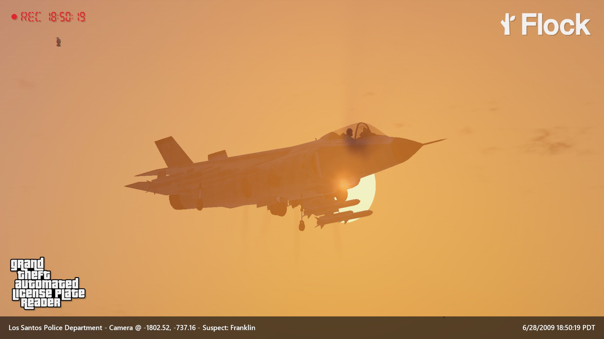
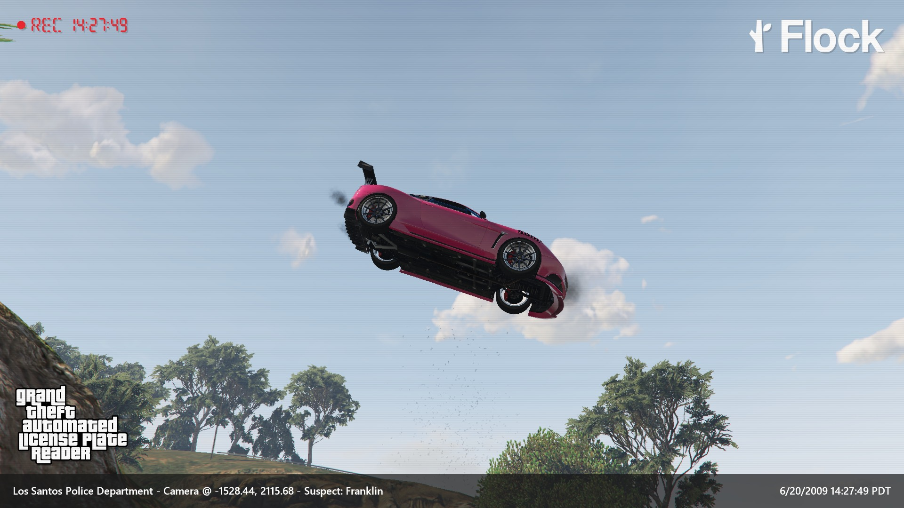
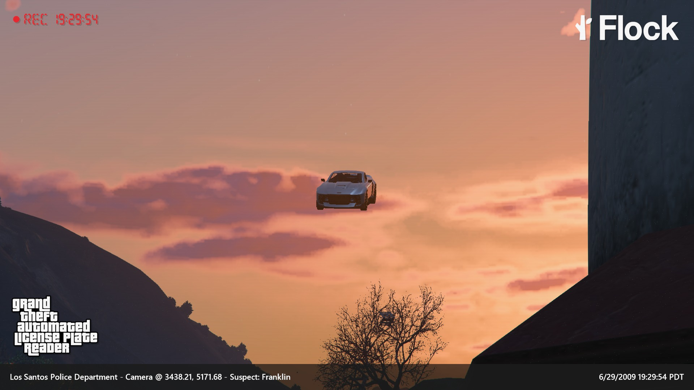

# Grand Theft Automated License Plate Reader (GTALPR)

## Description: 

Grant Theft Automated License Plate Reader is a GTA V mod that installs 235 Flock Automated License Plate Reader cameras (ALPRs) around the in-game map of Los Santos. This number is 1/10th the amount of Flock ALPRS currently tracked by [DeFlock.org](https://deflock.org) in LA County, which GTA V is heavily based on. As players drive through the map, they are subjected to seemingly inescapable surveillance, with pictures taken of them every time they enter a new camera's field of view. This makes the game much harder, as not only does police surveillance become nearly impossible to evade, but representing Flock's own history of inaccurate reporting, every time a player passes through a camera's field of view, the mod creates a 1 in 20 chance that the ALPR will trigger a police chase without any cause.

A few other notable features:
1. When destroyed, players can pick up the remnants of the camera for $600, the estimated market value of all components in a Flock camera based on a list created in a [hardware teardown by EyesOffCR](https://eyesoffcr.org/blog/blog-8.html).
2. While Los Santos is a shrunken and fictionalized version of LA, there are many points across the two where their maps and camera placements are near one-to-one. Muscle Beach & Muscle Sands is a good example (see below).
3. Players can choose to have the cameras take actual pictures of them while they play and then render and save them later. The pictures that the mod's Flock cameras take mimic Flock's own watermarking/overlays and support widescreen as well as 4:5 and 9:16 vertical formats for easy sharing on socials. Pictures can also be taken any time a player destroys a camera, letting them compile an album of destruction.
4. The 3D model used for the camera in game is custom-built to mimic Flock's own cameras.
5. There is built-in speedrun functionality, with a stats screen tracking number of cameras destroyed, and fastest time to destroy 10, 50, or all cameras.
6. Players can place and save _their own cameras_ around the map, allowing them to set up photoshoots with surveillance (examples below)

## Installation
You can download the latest version of the mod from the [releases page](https://github.com/wttdotm/gtalpr/releases). Instructions for installation are included in the description of the release, in the `INSTRUCTIONS.md` file in this repo, and  the `INSTRUCTIONS.md` file in the ZIP. All instructions are the same.

## Settings & Defaults
Most of the features of the mod are toggleable in settings. Here are some of the most important ones and their default states:

| Setting                  | Description                                                                                                    | Location  | Default        |
|--------------------------|----------------------------------------------------------------------------------------------------------------|-----------|----------------|
| Cameras Network Enabled  | Turns all cameras and related functionality on/off (basically a total on/off switch)                           | Main Menu | On             |
| Show FOV Debug Geometry  | Shows a basic wireframe FOV for every camera. Useful for seeing them coming and knowing their range.           | Main Menu | Off            |
| Show Line of Sight       | When within a camera's FOV, shows a line of sight from the camera to the player. Useful for seeing the camera. | Main Menu | On             |
| Capture Photos           | Captures photos for rendering whenever you drive into a camera's line of sight.                                | Photos    | On             |
| Camera Destruction Cam   | Captures photos for rendering whenever you destroy a camera (within a reasonable distance)                     | Photos    | On             |
| Aspect Ratios            | Different aspect ratios that the photo captures get cropped to (original, 4:5, 9:16)                           | Photos    | Original, 9:16 |
| CCTV Filter              | Two settings that affect whether a CCTV filter is applied to the photos and how strong it is                   | Photos    | On, 0.65       |                                                                                |           |         |

## Gallery

Some favorite images so far:

_Camera capture of car escaping the cops:_

_In-game view of a camera at sunset:_

_Image captured by the camera-destruction functionality:_

_Another image captured by camera-destruction:_

_The cameras trigger when the player is in any vehicle, including tanks..._

_And planes!_

_A photo taken by a player-placed camera:_

_A photo taken by the camera at the Lighthouse Stunt Jump:_

## Contributing / Modifying
As you can see, this repo is a bit of a mess. I'm a JS and Python guy, so I do not know C# and I developed most of it by iterating and tweaking funcionality with an LLM. Most of the important logic of the mod (camera loading and placement, camera FOV, reporting flow, etc) lives in `SurveillanceScript.cs`, so start there. Stats logic lives in `SurveillanceStats.cs`, and then most of the other files are pretty much all dedicated to the photo capture and rendering workflow.

## Special Thanks
...to Sean Kennedy [@aie_sean](https://instagram.com/aie_sean) for creating the 3d model of the Flock camera used in the mod.

...and to [Albert Sellars LLP](https://www.albertsellars.law/) for their pro bono legal assistance in the release of this mod.

## Disclaimer
All trademarks are the property of their respective owners. GTALPR is in no way endorsed by or affiliated with Flock or Rockstar Games. Like Grand Theft Auto generally, the mechanics and gameplay of GTALPR are not an endorsement of the activities players may perform with the mod. Destroying Flock cameras in real life is illegal and will not, as far as we know, give you a loot box with $600.

The Flock logo in flock_logo_transparent.png is not subject to the license of GTALPR and is owned by Flock.

## Contact
For any questions or inquiries, please contact me at wttdotm [at] gmail [dot] com.
